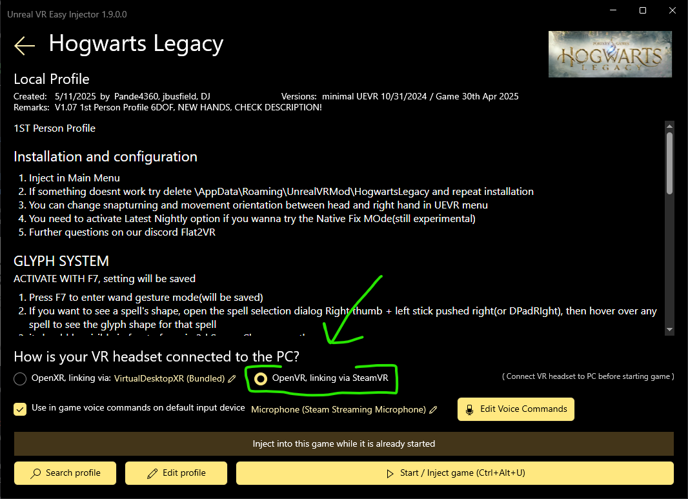

# Hogwarts Legacy VR how-to

[Flat2VR Discord](https://discord.com/channels/747967102895390741/1073648949057048628)

## Setup

Go to <https://uevrdeluxe.org>

Download and install

<https://github.com/oduis/UEVRDeluxe/releases>

(take the latest version, not necessarily the one in the screenshot)

Direct download of latest EXE
https://github.com/oduis/UEVRDeluxe/releases/latest/download/UEVREasyInjector.exe

Windows Defender might warn you about running the installer.  
Click "More info" and "Run anyway".

DISCLAIMER: use your own judgment about running software from the internet.

Now run the installed program.  
It should be in your Start Menu or Desktop as "Unreal VR Easy Injector"

Choose Hogwarts Legacy

Search profile

Choose 1st Person and Install

This guide was originally written for the V1.05b 1st Person Profile.  
Setup works the same for V1.06 1st Person Profile with Glyph Gestures.  
I am still updating the controls section for the new features. (2025-03-04)

Run **Hogwarts Legacy** as normal

Let it load. Choose your save. Let that load.

Now tab out of the game (Alt+Tab) so you can again see the **UEVR Easy Injector** window

Connect your VR HMD (head mounted display) to your PC

I have Meta Quest 3, using Virtual Desktop wireless and their VDXR runtime

If you use Meta Link wired or Meta Air Link wireless, that's fine too

If you use SteamLink with SteamVR, then choose "OpenVR, linking via SteamVR"

If you have another HMD that's not Quest, it should also work. But I have no experience with it.

You're wearing your HMD and you can see your desktop and Hogwarts Legacy is still running?

Great!

Press "Start / Inject game"

Give it a few seconds, and you'll be in Hogwarts in VR

Not happening?  
Press Stop Game.  
Then Start / Inject again.  
Should work the 2nd time.

## Performance

Game is very laggy?

There are lots of settings to play with

Turn off ray-tracing

Turn graphics preset down to Low

Try DLSS on and see if it helps

If the in-game settings don't get you a frame-rate that you find acceptable, then lower the resolution and/or bit-rate in the settings of your PC link software (Virtual Desktop, Meta Link, SteamVR, etc.)
A restart of the game is likely required

Remember, this game was not meant to run in VR. It is not optimized for it at all. It's already hardware intensive when flat 4K at 60 fps, and we're shoving VR down its throat. That means everything is rendered twice, once for each eye's perspective, at higher resolutions and higher frame-rate.

## Controls

### D-Pad

Rest your right thumb to the left of the \[A\] and \[B\] buttons  
There is a touch sensor there. Similar to how the buttons and analog-stick also sense that your finger is resting on it but not pressing.

The left analog-stick (on the left controller) will now function as a Direction Pad, while you continue to hold the right thumb-rest.

This is known as D-shifting. Mode-shift for the d-pad.

UEVR has settings in its advanced "Inputs" tab to change this

1. Swap hands (left thumb-rest, right analog-stick)
2. Make a thumb-stick always the d-pad
3. D-shift when lifting the controller close to your head

What the d-pad does is the same as in the flat game (non-VR)

◀ (left) _Revelio_ spell  
▶ (right) Spell select menu  
🔻 (down) Health (wiggenweld potion)  
🔺 (up) Reveal path to tracked objective or location (see map)

### Wand

Move your right hand and the wand moves (motion controlled)

Can't see it? Try pressing the trigger to cast a spell.  
If it still doesn't appear, you may need to restart the game

Cast other spells by holding the trigger and moving the analog-stick up/down/left/right to cast the corresponding spell as seen on the HUD. This is special for this UEVR profile.  
The buttons \[A\] \[B\] \[X\] \[Y\] also work, just like in flat mode (non-VR)

To **open chests** or collect **field guide pages** or otherwise interact with things, point the wand at it and press \[X\]  
You might find this a bit finicky. Get close enough to the object. Slowly rotate your hand up/down and left/right until you can see the button prompt.

Remember, we're grafting first-person VR motion controls onto a third-person free-camera game  
It's not going to be perfect  
Let's be happy how lucky we are to have this at all  
To quote Louis CK about airplanes, "You're sitting in a chair… in the SKY!"  
<https://youtu.be/oTcAWN5R5-I?si=Gwr_ZDbzYkHQO91H>

#### Glyph Gestures

Available in the V1.06 profile

Instructions are in the profile's description
1. Press F1 to go into 1st person view
1. Press F7 to enable gestures
1. Gestures shown in the games spell management menu (d-pad right)
1. Hold right trigger and draw the glyph in the air

Pictures for this guide coming soon (2025-03-04)

#### Epic Games Store

If your installation of Hogwarts Legacy is from the Epic Games Store, then motion controls might not work at first.

A suggested fix is to remove the file  
"C:\Program Files\Epic Games\Hogwarts Legacy\Phoenix\Binaries\Win64\EOSSDK-Win64-Shipping.dll"

Rename it, move it to another folder, or delete it entirely.

### Menu & Map

Left controller "system" button opens the menu.  
Hold for a second and release to open the map.

Menu cursor is controlled with the analog-stick. Not motion control.

If using **SteamVR**, then the "system" button will bring up the SteamVR overlay/dashboard.  
So you need to disable that in SteamVR settings.

For some reason, this option only appears in the desktop window, not in the VR dashboard.  
Your HMD needs to be connected. And show "Advanced Settings".

## Miscellaneous

### Open UEVR Settings In-Game

Press both analog-sticks simultaneously. Or press the "Insert" \[INS\] key on your keyboard.

Press again to close

If the menu does not appear before you, then it might be behind you or to the side

Check the "Show Advanced Options" checkbox to see even more things to fiddle with

### HUD following hand instead of head

Open UEVR settings

Go to "Runtime" tab

Check "UI Follows View"

### UEVR links

Praydog's site <https://uevr.io/>

Release download <https://github.com/praydog/UEVR/releases/>

Nightly builds <https://github.com/praydog/UEVR-nightly/releases>

A "nightly build" is like a beta version. It includes whatever work was done on the source-code that day, even if it's broken or otherwise not ready for stable release. The advantage of using these is that some bugs might be fixed and some new features added. But don't complain if it doesn't work.

Tutorials <https://www.youtube.com/watch?v=CW60zLLo2fw&list=PLyE0aREJRIBLMQREfAFXKSQydoI-h4Vfh>
