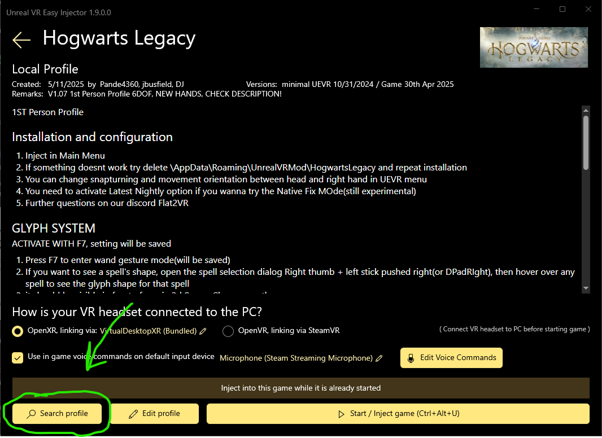

# A Guide to Hogwarts Legacy in VR

Join the **Flat2VR Discord**
1. [#ue-hogwarts](https://discord.com/channels/747967102895390741/1363692053229207792) (new channel 2025-04-20)
2. [old thread](https://discord.com/channels/747967102895390741/1073648949057048628) under #ue-games

> [!IMPORTANT]
> Version 1.08a of the profile has been released (2025-06-17), bringing new features and performance improvements.  
> This guide has been updated for the new configuration options, and also retains instructions for the older profiles.

## Setup

We will be using UEVR to make _Hogwarts Legacy_ run in VR.  
We will also use a profile that allows for 1st person perspective, a motion-controlled wand, and (optionally) casting spells by drawing glyphs in the air.
You can also still use an [Xbox controller](#disable-motion-controls) and toggle into [3rd person](#profile-configuration-options).

This guide assumes you understand how to
1. Download programs and files from the internet
2. Install software on your computer
3. Extract the contents of a zip file
4. Connect your chosen VR headset to your computer to play VR games

You should also have already played some of Hogwarts Legacy without VR and be familiar with the controls for moving, casting spells, and changing assigned spells.

<br>

UEVR is a tool that injects VR support into Unreal Engine games that do not have it natively.
* UEVR website <https://uevr.io>
* UEVR Github <https://github.com/praydog/UEVR>

To use this directly, see instructions here --> [Praydog's injector + Nexus Mods](standard-injector-instructions.md)

<br>

"Unreal Easy Injector" (previously known as UEVR Deluxe) is a tool derived from UEVR that simplifies the process of setting up UEVR by providing profiles for specific games and presenting a cleaner, simplified user interface.
* Unreal Easy Injector website <https://uevrdeluxe.org>
* Unreal Easy Injector GitHub <https://github.com/oduis/UEVRDeluxe>

To use this method (recommended), read on.

[(_super quick instructions_)](super-quick-instructions.md)

### Installing Unreal Easy Injector

Go to the [website](https://uevrdeluxe.org) and click on "Download latest release"


<br>

Clicking that link will take you to the GitHub release page.  
After the release notes, under "Assets", click on the **UEVREasyInjector.exe** to download it.

Take the latest version. This screenshot might be outdated.


You can also get a **direct download** of the latest EXE by clicking here  
https://github.com/oduis/UEVRDeluxe/releases/latest/download/UEVREasyInjector.exe

<br>

Once the installer is downloaded, run it.

Windows Defender might warn you about running the installer.  
Click "More info" and "Run anyway".

DISCLAIMER: use your own judgment about running software from the internet.


### Installing the 1st Person Profile

Now run the installed program.  
It should be in your Start Menu or Desktop as "Unreal VR Easy Injector"


<br>

Choose Hogwarts Legacy


<br>

Press "Search profile"



<br>

Select the latest 1<sup>st</sup> Person profile created by Pande4360, jbusfield, DJ  
Then press "Install"


This profile is created by Pande4360, jbusfield, DJ  
and is therefore called the PJD profile.  
It can also be downloaded from Nexus Mods  
https://www.nexusmods.com/hogwartslegacy/mods/2264  
Or GitHub  
https://github.com/jbusfield/HL_UEVR

You can play Hogwarts Legacy in VR without this profile.  
It will be in 3rd person, controlled by your Xbox controller, or keyboard and mouse.  
If you want to play in 1st person with motion controls, then you need this profile.  
Also see [Profile Configuration Options](#profile-configuration-options) for additional settings you can change provided by this profile.

### Connect your VR headset

Connect your VR HMD (head mounted display) to your PC.

UEVR and the PJD profile should work with any headset.  
But there have been issues reported on the [Flat2VR Discord](https://discord.com/channels/747967102895390741/1363692053229207792) with certain HMDs.

Ensure that Open**X**R is selected in UEVR Easy Injector under "How is your VR headset connected to the PC?".


DO NOT choose OpenVR unless you have a Valve Index, or other HMD that _only_ works with SteamVR.  
Even if your HMD _can_ work with OpenVR, OpenXR is newer and will provide the best performance.

<br>

If Meta Quest as your HMD, then there are a few software options for connecting to your PC

| Method                                                                                | Type          | Cost | OpenXR Runtime | Notes                                                                                                           |
|---------------------------------------------------------------------------------------|---------------|------|----------------|-----------------------------------------------------------------------------------------------------------------|
| Meta Link                                                                             | Wired 🔌      | Free | Meta           | Wire sold separately. The charging cable that comes with the Quest does not have sufficient data transfer rate. |
| Meta Air Link                                                                         | Wireless only | Free | Meta           | Unpopular, but built in, with official Meta support.                                                            |
| [Virtual Desktop](https://www.meta.com/experiences/virtual-desktop/2017050365004772/) | Wireless only | $25  | VDXR           | Widely regarded as the best option for performance, quality, and stability.                                     |
| Steam Link                                                                            | Wireless only | Free | SteamVR        | Requires SteamVR to run.                                                                                        |
| ALVR                                                                                  | Wireless only | Free |                | Open source, for tinkerers.                                                                                     |

<br>

Whichever software you choose, you must use it to set the OpenXR runtime of your system to the one provided by that software.

For example, with Virtual Desktop, be sure to set the OpenXR Runtime to **VDXR** in the Virtual Desktop Streamer app on your PC.  
DO NOT leave it on Automatic.


If instead you are using Meta Link or Meta Air Link, be sure to set Meta Quest Link as the active OpenXR Runtime.


If instead you are using Steam Link, be sure to set SteamVR as the active OpenXR Runtime.


<br>

These software options are mutually exclusive.  
DO NOT run more than one of these at the same time.

Only Steam Link needs SteamVR to run.  
If you're using Virtual Desktop, do not run SteamVR.  
If you're using Meta, do not run SteamVR.  
_Even if you own Hogwarts Legacy on Steam._

### Injecting

Keep the "Unreal VR Easy Injector" window open.

Start **Hogwarts Legacy** as you normally would. Through Steam or Epic or wherever.

Wait for the game to load and enter the character/save-slot selection screen.

Put on your HMD again, if you took it off, and ensure it is still connected to your desktop.

Now, with the Hogwarts Legacy window in focus, press `Ctrl + Alt + U` on your keyboard to inject VR into the game.

There might be a few seconds of darkness. Be patient. But then you will be immersed in the wonderful Wizarding World!

🧙‍♂️✨🧙‍♀️

<br>

Move your right controller to move the curser and select your character with the [A] button on your right controller.
(you can turn off "cursor follows controller" in [hogwarts config](#profile-configuration-options))

If you are starting a new game, there is a rollercoaster at Gringotts early on.  
While this is super cool to experience in VR, it is also known to crash the game.  
So after enjoying it once, you might have to play through that part without VR to progress.

<br>

If the `Ctrl + Alt + U` keyboard shortcut is not working, or you just don't want to use it, you can also tab-out of the fullscreen game (`Alt + Tab`) to see the Easy Injector window, and press "Start / Inject game" there.


## Troubleshooting

0️⃣
Nothing's happening? 😭  
&nbsp;&nbsp;&nbsp;&nbsp;&nbsp; Dont worry.  
&nbsp;&nbsp;&nbsp;&nbsp;&nbsp; Use `Alt + Tab` to focus the Easy Injector window.  
&nbsp;&nbsp;&nbsp;&nbsp;&nbsp; Press "Stop Game".  
&nbsp;&nbsp;&nbsp;&nbsp;&nbsp; Then "Start / Inject game" again.  
&nbsp;&nbsp;&nbsp;&nbsp;&nbsp; Should work the 2<sup>nd</sup> time.  

&nbsp;&nbsp;&nbsp;&nbsp;&nbsp; But this should be fixed in version `1.7.2.0+` of UEVR Easy Injector.

<br>

1️⃣
If HMD shows a black screen and everything freezes, then **turn off Frame Generation** in the game's settings.  
  
This is _not_ the same as re-projection/space-warp/SSW/ASW that is done by the VR renderer.  

<br>

2️⃣
Turn off **HAGS** (Hardware Accelerated GPU Scheduling) in Windows settings and restart your computer.

<br>

3️⃣
Did you forget to set OpenXR in UEVR Easy Injector and set the proper runtime?  
&nbsp;&nbsp;&nbsp;&nbsp;&nbsp; Review [Connect your VR Headset](#connect-your-vr-headset)

<br>

4️⃣
Not in 1st person?  
&nbsp;&nbsp;&nbsp;&nbsp;&nbsp; See [Profile Configuration Options](#profile-configuration-options)

<br>

5️⃣
Motion controls or buttons not working?

&nbsp;&nbsp;&nbsp;&nbsp;&nbsp; Some menus do not have motion controls (yet).  
&nbsp;&nbsp;&nbsp;&nbsp;&nbsp; Instead, use the analog-stick on the left controller to move the cursor.

&nbsp;&nbsp;&nbsp;&nbsp;&nbsp; For Valve Index controllers, you need this  
&nbsp;&nbsp;&nbsp;&nbsp;&nbsp; https://github.com/mark-mon/uevr-index-controls

&nbsp;&nbsp;&nbsp;&nbsp;&nbsp; If your copy of Hogwarts Legacy is from the Epic Games Store, then see the [Epic Games Store](#epic-games-store) section.  
&nbsp;&nbsp;&nbsp;&nbsp;&nbsp; You need to remove a file from the game directory.

<br>

6️⃣
I'm moving in the wrong direction! Help!  
&nbsp;&nbsp;&nbsp;&nbsp;&nbsp; Change your locomotion mode in the [Profile Configuration Options](#profile-configuration-options)

<br>

7️⃣
My spells go in a different direction than where I am pointing!  
&nbsp;&nbsp;&nbsp;&nbsp;&nbsp; Like this? https://www.youtube.com/watch?v=42K68ElOtok  

&nbsp;&nbsp;&nbsp;&nbsp;&nbsp; 'Camera-relative targeting' needs to be set to ON.  
&nbsp;&nbsp;&nbsp;&nbsp;&nbsp; This is in the Hogwarts game settings. Not in UEVR settings.

<br>

8️⃣
Why is the [B] button not going back in menus?  
&nbsp;&nbsp;&nbsp;&nbsp;&nbsp; Why is the [X] button dodging and not interacting?  
&nbsp;&nbsp;&nbsp;&nbsp;&nbsp; See [Swapped B and X buttons](#swapped-b-and-x-buttons)

<br>

9️⃣
Cracked/pirated versions of the game do not work! 🏴‍☠️🚫

<br>

🔟
My hands and wand keep getting disconnected from the controllers.  
&nbsp;&nbsp;&nbsp;&nbsp;&nbsp; Unfortunately, this happens because of a flaw in UEVR, not the profile. It has been investigated and [confirmed](https://discord.com/channels/747967102895390741/1363692053229207792/1404595131780431964) by the profile creator.  
&nbsp;&nbsp;&nbsp;&nbsp;&nbsp; You must use the profile's built-in workaround of ["grabbing your right ear"](#wand)  
&nbsp;&nbsp;&nbsp;&nbsp;&nbsp; The detachment occurs more frequently within Hogwarts castle.

<br>

1️⃣1️⃣
You need to be using the **Nightly** version of UEVR. At least version 1096. But the latest nightly is probably also good.  
Easy Injector has an easy button to upgrade to the latest version. Or change to any specific version.  
  
If instead you are using the standard UEVR executable, then you need to download the Nightly build from GitHub https://github.com/praydog/UEVR-nightly/releases/  
The PJD profile does not work on the release version 1.05  
Do not ask how you can see which version you have, because it's not straightforward. Just get the Nightly.

1️⃣2️⃣
For PSVR2 users, you might need to adjust Steam Input bindings to make the system/menu button work.  
See this YouTube video https://www.youtube.com/watch?app=desktop&v=hIOpeIlQwl8&t=770s  
And see the section of this guide on the multiple [D-pad shifting modes](#d-pad)

## Performance

Game is very laggy?

There are lots of settings to play with

Turn off ray-tracing

Turn graphics preset down to Low

Try DLSS on and see if it helps

If the in-game settings don't get you a frame-rate that you find acceptable, then lower the resolution, framerate, and/or bit-rate in the settings of your PC link software (Virtual Desktop, Meta Link, SteamVR, etc.)  
A restart of the game is likely required

Remember, this game was not meant to run in VR. It is not optimized for it at all. It's already hardware intensive when flat 4K at 60 fps, and we're shoving VR down its throat. That means everything is rendered twice, once for each eye's perspective, at higher resolutions and higher frame-rate.

## Controls

### D-Pad

Rest your right thumb to the left of the [A] and [B] buttons  
There is a touch sensor there. Similar to how the buttons and analog-stick also sense that your finger is resting on it but not pressing.


The left analog-stick (on the left controller) will now function as a Direction Pad, while you continue to hold the right thumb-rest.

This is known as D-shifting. Mode-shift for the d-pad.

<details>
<summary>Expand for further details</summary>

> The quest controllers do not *actually* have a direction pad, aka d-pad, like an xbox controller.  
> Instead, we must emulate one.  
> Quest controllers have thumb-sticks, aka analogue-sticks, so we can use those like a d-pad.
>
> But if the stick is always acting as a d-pad, then we cannot use that stick for analogue input.  
> So by default, the stick acts as a stick. And only acts as a d-pad when you rest your thumb on the capacitive thumb-rest as shown in the guide picture.
>
> This concept is known as "d-shift".  
> As in, *shifting* the mode/behavior of the stick to act as a d-pad temporarily.
>
> This is the only use of the thumb-rest for this UEVR profile of this game.

</details>

UEVR has settings in its advanced "Inputs" tab to change this

1. Swap hands (left thumb-rest, right analog-stick)
2. Make a thumb-stick always the d-pad
3. D-shift when lifting the controller close to your head

What the d-pad does is the same as in the flat game (non-VR)

◀ (left) _Revelio_ spell  
▶ (right) Spell select menu  
🔻 (down) Health (wiggenweld potion)  
🔺 (up) Reveal path to tracked objective or location (see map)

[](#open-uevr-settings-in-game)

[how to open UEVR settings in-game](#open-uevr-settings-in-game)

### Wand

Move your right hand and the wand moves (motion controlled)

Can't see it? Try pressing the trigger to cast a spell.  
If it gets detached from your controller and stuck in the world, then just "grab your right ear": hold the right controller up to your right ear near  your HMD and press the grip button.  
If it still doesn't appear, you may need to restart the game.

Cast other spells by holding the trigger and moving the analog-stick up/down/left/right to cast the corresponding spell as seen on the HUD. This is a special feature of this PJD profile.  
The buttons [A] [B] [X] [Y] also work to cast spells, just like in flat mode (non-VR).

To **open chests** or collect **field guide pages** or otherwise interact with things, point the wand at it and press [B] on you right-hand Quest controller.  
Be sure you're pointing well and can see the button prompt to Press X (but actuality press B).
You might find this a bit finicky. Get close enough to the object. Or maybe you're too close. Slowly rotate your hand up/down and left/right until you can see the button prompt.  
It is known that the floating prompt moves in the inverse direction that you move your controller.

The [B] button of your right-hand Quest controller acts as an Xbox controller's [X] button.  
And the [X] button of your left-hand Quest controller acts as an Xbox controller's [B] button.  
B and X are swapped.  
This is the default mapping of UEVR. Not specific to the PJD profile.

Wondering how you can dodge (press X) while moving?  
See [Jump and Dodge](#jump-and-dodge)  
And [Swapped \[B\] and \[X\] buttons](#swapped-B-and-X-buttons)

#### Glyph Gestures

Starting in PJD profile version 1.08, there is a "Hogwarts Config" tab in the [UEVR settings](#open-uevr-settings-in-game) when showing advanced settings.  
See [Profile Configuration Options](#profile-configuration-options)  
Go there to enable spell-casting using gestures.

In previous versions, Press F7 on your keyboard to enable spell-casting using gestures.

Glyphs are shown in the game's spell management menu (d-pad right).  
Hover the curser over a spell to see what glyph to draw to cast that spell.  
The thicker and sparklier part of each line is its start, and it tapers off to its end.

--> [Screenshots of all glyphs](images/glyph-gestures/) <--

To cast spells...  
Go out of the menu.  
**Hold right trigger and draw the glyph in the air.**  
Time will slow down while you draw.  
Release the trigger and the spell will be cast.

The length of the lines you draw is not as important as the angle between the lines.

Tips from [profile author 'jbusfield' — 2025-03-05](https://discord.com/channels/747967102895390741/1073648949057048628/1346903324703723543)
> Glyphs are detected based on the angles between one line you draw and the next.  
> So if you want to draw a box for reparo, draw straight up, straight right, straight down, then straight left.  
> Be very deliberate with your strokes.  
> If the drawing system does not detect that what you have drawn so far will result in a valid glyph, then it will stop detecting and vibrate your controller as you saw in your first attempt.  
> Drawing direction goes from the thick end of the line to the thin end in the examples in the spell menu.

<br>

In profiles before version 1.08, for Glyph Gestures to be enabled each time you start the game and inject, you must edit a file in the profile.  
`%appdata%\UnrealVRMod\HogwartsLegacy\plugins\ue4ss\Mods\VRFP\scripts\config.lua`
```lua
--[[
Gesture Mode
0 = No gestures
1 = Spells can be cast by drawing glyphs. Wrist flick casts previous spell
]]--
gestureMode = 1
```

#### Epic Games Store

If your installation of Hogwarts Legacy is from the Epic Games Store, then motion controls or some buttons might not work at first.

To fix this, remove the file  
"C:\Program Files\Epic Games\Hogwarts Legacy\Phoenix\Binaries\Win64\EOSSDK-Win64-Shipping.dll"

Either rename it or move it to another folder.

⚠ WARNING: without this file, you may experience issues connecting to your WB Games account and installing official mods.

### Profile Configuration Options

Starting in PJD profile version 1.08, there is a "Hogwarts Config" tab in the [UEVR settings](#open-uevr-settings-in-game) when showing advanced settings.


In previous versions, the PJD profile provided the following keyboard functions:  

| Key | Function                                                                                                                                                                                                                                                                                                                          |
|-----|-----------------------------------------------------------------------------------------------------------------------------------------------------------------------------------------------------------------------------------------------------------------------------------------------------------------------------------|
| F1  | Switch between 1st and 3rd person point of view.                                                                                                                                                                                                                                                                                  |
| F2  | Switch between UEVR's Native Stereo and Synced Sequential rendering methods.                                                                                                                                                                                                                                                      |
| F3  | Cycle through the player Locomotion (movement) modes: <br> 1. Follow wand/hand direction. <br> 2. Follow head direction. <br> 3. Only analog-stick controls direction. Smooth or snap-turn can be chosen in the [UEVR settings](#open-uevr-settings-in-game)                                                                      |
| F4  | Toggle the game's Fog effect on/off.                                                                                                                                                                                                                                                                                              |
| F5  | Toggle 2D screen.                                                                                                                                                                                                                                                                                                                 |
| F6  | Enable/disable the use of the analog-stick for casting spells, when Gestures are disabled. <br> When enabled, hold the right trigger and push the right analog-stick in the cardinal direction of the spell slot as shown on the HUD. <br> When disabled, only the buttons [A] [B] [X] [Y] cast spells while holding the trigger. |
| F7  | Enable/disable casting spells by drawing Glyphs in the air. <br> See the [Glyph Gestures](#glyph-gestures) section.                                                                                                                                                                                                               |
| F8  | Toggle visibility of a circular aiming reticle that shows where your wand is pointing.                                                                                                                                                                                                                                            |
| F9  | Switch between manual and auto Targeting.                                                                                                                                                                                                                                                                                         |

These key presses are temporary changes. They will not persist between game sessions.  
To persist your settings, so that they are used each time you start and inject, you must edit a file in the profile.  
`%appdata%\UnrealVRMod\HogwartsLegacy\plugins\ue4ss\Mods\VRFP\scripts\config.lua`
 
<br>

Adjust wand position relative to controller

| Key            | Direction         |
|----------------|-------------------|
| numpad 8       | up (y-axis)       |
| numpad 2       | down (y-axis)     |
| alt + numpad 8 | forward (z-axis)  |
| alt + numpad 2 | backward (z-axis) |
| alt + numpad 4 | left (x-axis)     |
| alt + numpad 2 | right (x-axis)    |

Adjust wand rotation

| Keys         | Axis           |
|--------------|----------------|
| numpad 7 / 9 | pitch (x-axis) |
| numpad 4 / 6 | roll  (z-axis) |
| numpad 1 / 3 | yaw   (y-axis) |

### Menu & Map

Left controller "system" button opens the menu.  
Hold for a second and release to open the map.

Starting in PJD profile version 1.08, some menus can have the cursor move with motion control.  
Enable it in the "Hogwarts Config" tab of [UEVR settings](#open-uevr-settings-in-game)  
See [Profile Configuration Options](#profile-configuration-options)

Other menus, and in previous profile versions, the cursor is controlled with the analog-stick. Not motion control.

If using **SteamVR**, then the "system" button will bring up the SteamVR overlay/dashboard.  
So you need to disable that in SteamVR settings.


For some reason, this option only appears in the desktop window, not in the VR dashboard.  
Your HMD still needs to be connected. And show "Advanced Settings".

### Jump and Dodge

With the PJD profile, pushing up on the right analog-stick will jump, and pushing down will dodge.

If you still want to remap the [B] and [X] buttons, then read the next section.

### Swapped [B] and [X] buttons

By default, UEVR maps the [B] button of your right-hand motion controller to act as the [X] button of an Xbox controller.  
In Hogwarts Legacy, this is used to interact with objects, or cast the spell assigned to the West slot.

UEVR also maps the [X] button of your left-hand motion controller (for Valve Index, that's the other [A] on your left-hand) to act as the [B] button of an Xbox controller.  
In Hogwarts Legacy, this is used to dodge, cast the spell assigned to the East slot, or go back in a menu.

If instead you want the button labeled [B] to act as [B] and the button labeled [X] to act as [X], or make any other button binding changes, you can do that in [UEVR settings](#open-uevr-settings-in-game).

In the "Runtime" tab, expand the "Bindings" section, which is at the bottom of "OpenXR Options" and directly above "Overlay Options".


If you have a Meta Quest, then you can put this json file [_interaction_profiles_oculus_touch_controller.json](_interaction_profiles_oculus_touch_controller.json)  
directly into your UEVR profiles directory for Hogwarts Legacy (`%appdata%\UnrealVRMod\HogwartsLegacy`)  
and it will override the default bindings.  
This is the same as if you had changed the bindings in the UEVR settings yourself.

The important bits are these:
```json
{
    "action": "bbuttonright",
    "path": "/user/hand/left/input/x/click"
},
{
    "action": "bbuttontouchright",
    "path": "/user/hand/left/input/x/touch"
},
...
{
    "action": "abuttonleft",
    "path": "/user/hand/right/input/b/click"
},
{
    "action": "abuttontouchleft",
    "path": "/user/hand/right/input/b/touch"
}
```

To learn more, read [UEVR Bindings](uevr-bindings.md)

<br>

With the PJD profile, "up" on the right analog-stick will jump, and "down" will dodge.  
So you don't have to remap the [B] and [X] buttons to dodge well, if you don't want to.

## Miscellaneous

### Open UEVR Settings In-Game

Press both analog-sticks simultaneously.  
Or press the "Insert" [INS] key on your keyboard.

Press again to close.

If the menu does not appear before you, then it might be behind you or to the side.  
Try turning your head to look around.  
Or recenter your view. On Quest, do that by holding the Meta button.

At the top-left of the floating settings window, check the "Show Advanced Options" checkbox to see even more things to fiddle with.

### HUD following hand instead of head

Open UEVR settings

Starting in PJD profile version 1.08, there is a "Hogwarts Config" tab with the option "Attach UI to View".  
See [Profile Configuration Options](#profile-configuration-options)

For previous versions, go to the "Runtime" tab and enable "UI Follows View".


### Disable motion-controls
You want to use an Xbox controller only.  
Not VR motion-controls.

Then you do not need the PJD profile.  
Most of the scripts are for making motion-controls work.  
UEVR injection works out-of-the-box to put your head where the camera is, and you play with you Xbox controller or keyboard and mouse.  
You do not need to download profiles. This is true for any game.

If you're using the PJD profile because you want a 1st person view, then you need this separate version of the profile to disable the motion-controls.  
Forked from v1.08a by [BlueScorpio](https://discord.com/channels/747967102895390741/1363692053229207792/1397891528776617995)  
Get it here: https://github.com/pdebaty/HL_UEVR_no_controllers

Alternatively, you can get 1st person mods from Nexus Mods or CurseForge and other places.  
Mods that are unrelated to VR, but will still work with UEVR.

### UEVR links

Praydog's site <https://uevr.io/>

Release download <https://github.com/praydog/UEVR/releases/>

Nightly builds <https://github.com/praydog/UEVR-nightly/releases>

A "nightly build" is like a beta version. It includes whatever work was done on the source-code that day, even if it's broken or otherwise not ready for stable release. The advantage of using these is that some bugs might be fixed and some new features added. But don't complain if it doesn't work.

Tutorials <https://www.youtube.com/watch?v=CW60zLLo2fw&list=PLyE0aREJRIBLMQREfAFXKSQydoI-h4Vfh>
