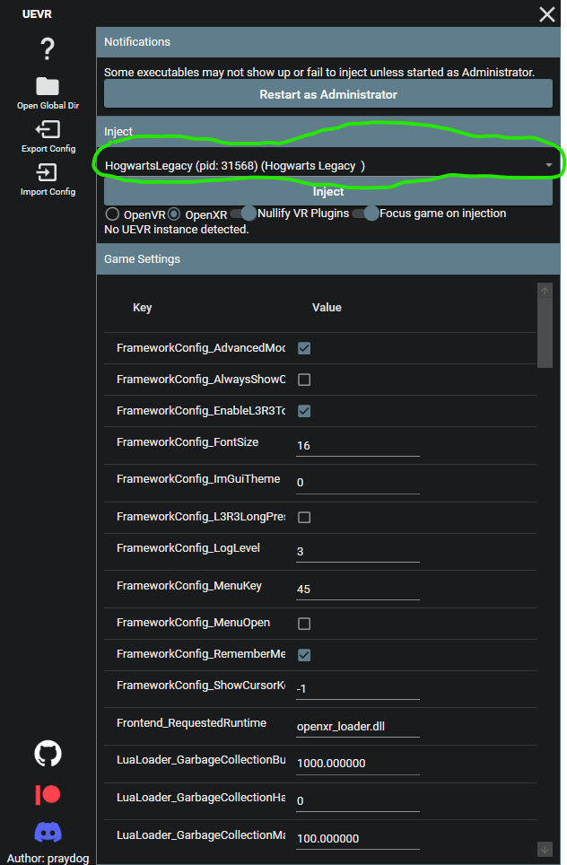
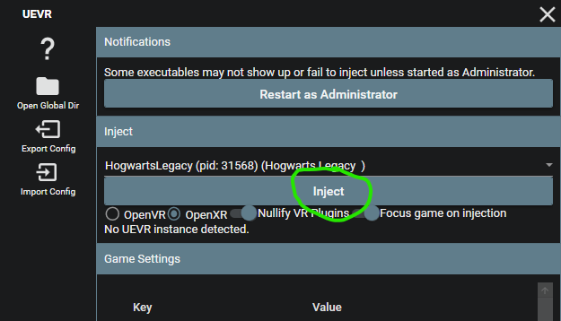

# Praydog's UEVR + Nexus Mods

Download the latest stable release of UEVR
https://github.com/praydog/UEVR/releases/latest/download/UEVR.zip

(all releases https://github.com/praydog/UEVR/releases)

Extract that to a nice, safe spot.

Run "UEVRInjector.exe"

Press "Open Global Dir"

This will open your file explorer to the UEVR profiles directory.  
`C:\Users\*****\AppData\Roaming\UnrealVRMod`

Now go to Nexus Mods and download the profile you want to use.

UEVR Profile 6DOF for Hogwarts Legacy  
created by Pande4360, jbusfield, DJ  
https://www.nexusmods.com/hogwartslegacy/mods/2264

Direct link to the profile zip uploaded on `14 Feb 2025, 9:14AM`  
https://www.nexusmods.com/hogwartslegacy/mods/2264?tab=files&file_id=7249

From that zip, extract the top-level `HogwartsLegacy` folder into the UEVR profiles directory.  
So that inside `UnrealVRMod` you have `HogwartsLegacy`.

You're all set up with the profile.

 

Now run Hogwarts Legacy as you would normally and load into your save game.

Tab out of the game (Alt+Tab) so you can access the UEVR window.

Click the processes dropdown and select `HogwartsLegacy-Win64-Shipping.exe`

 

Set the VR runtime, depending on how you connect your HMD to your PC:

| VR HMD to PC connection | Set Runtime to | Note |
|---|---|---|
| Meta Link (USB) | OpenXR |Even if you own Hogwarts Legacy on Steam |
| Meta Air Link | OpenXR | Even if you own Hogwarts Legacy on Steam |
| Virtual Desktop | OpenXR | Also set **VDXR** in the Virtual Desktop Streamer app on your PC. Even if you own Hogwarts Legacy on Steam |
| SteamLink | OpenVR | With a "V", not an "X" |

There is no need to use SteamVR if you use Virtual Desktop or Meta Link or any other connection method.

 

If you haven't already, connect your VR HMD to your PC.

Now press Inject in UEVR.

 

You should now be in Hogwarts Legacy in VR!

Return to the [main guide](README.md) for explanation of controls, performance advice, and troubleshooting.

Thanks for reading!