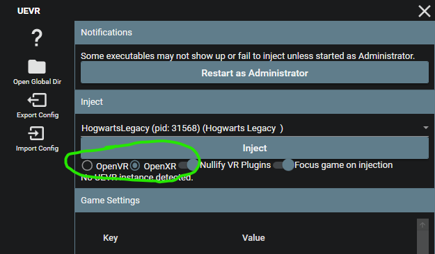

# Praydog's UEVR + Nexus Mods

Download the latest **nightly** release of UEVR  
https://github.com/praydog/UEVR-nightly/releases/latest/download/UEVR.zip  

(past nightly builds https://github.com/praydog/UEVR-nightly/releases/)

Extract that to a nice, safe spot.

Run "UEVRInjector.exe"

 

Now go to Nexus Mods and download the profile you want to use.

UEVR Profile 6DOF for Hogwarts Legacy  
created by Pande4360, jbusfield, DJ  
https://www.nexusmods.com/hogwartslegacy/mods/2264

Direct link to the latest profile zip 
https://www.nexusmods.com/hogwartslegacy/mods/2264?tab=files&file_id=7344

 

In the UEVR window, press "Import Config" and select the downloaded zip file. 

A file explorer window will open to `C:\Users\*****\AppData\Roaming\UnrealVRMod\HogwartsLegacy\`, showing the extracted contents.  
You can close that window.

You're all set up with the profile.

 

Now start the Hogwarts Legacy game as you would normally and load into your save game.

Tab out of the game (`Alt + Tab`) so you can access the UEVR window.

Click the processes dropdown and select `HogwartsLegacy`

 

Set the VR runtime to OpenXR

 

Connect your VR HMD to your PC.  
(Virtual Desktop, Meta Link, SteamLink, etc.)

Now press Inject in UEVR.

 

You should now be in Hogwarts Legacy in VR!

Return to the [main guide](README.md) for explanation of controls, performance advice, and troubleshooting.

Thanks for reading!