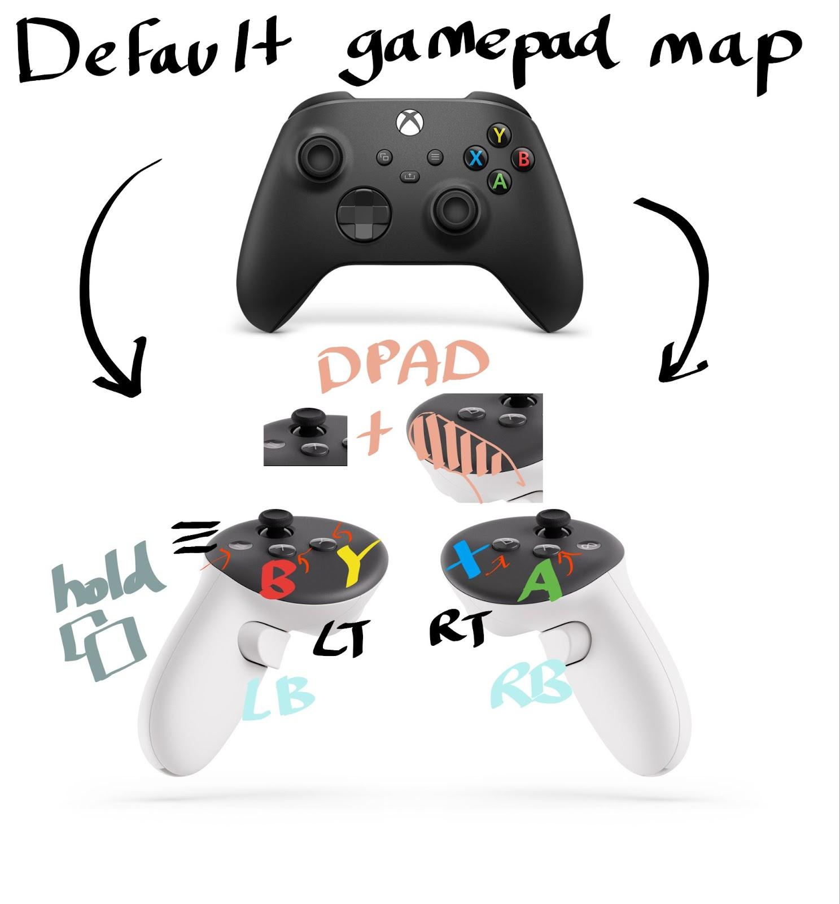

# UEVR Bindings


<small>image from https://docs.google.com/spreadsheets/d/1ZcjCQwzPOltaRZnpYU5_HPihEDareZq_0Ww1DZQ4USw</small>

| Quest Controllers     | Path                               | Action         | Xbox Controller |
|-----------------------|------------------------------------|----------------|-----------------|
| Right A               | "/user/hand/right/input/a/click"   | `abuttonright` | A               |
| Right B               | "/user/hand/right/input/b/click"   | `bbuttonright` | X               |
| Left X                | "/user/hand/left/input/x/click"    | `abuttonleft`  | B               |
| Left Y                | "/user/hand/left/input/y/click"    | `bbuttonleft`  | Y               |
| Right Trigger         | "/user/hand/right/input/trigger"   | `trigger`      | Right Trigger   |
| Left Trigger          | "/user/hand/left/input/trigger"    | `trigger`      | Left Trigger    |
| Right Grip            | "/user/hand/right/input/squeeze"   | `grip`         | Right Bumper    |
| Left Grip             | "/user/hand/left/input/squeeze"    | `grip`         | Left Bumper     |
| Menu quick press      | "/user/hand/left/input/menu/click" | `systembutton` | Menu            |
| Menu hold and release | "/user/hand/left/input/menu/click" | `systembutton` | View            |

The Actions appear to represent an abstract pair of VR motion controllers.  
Not specifically the Quest controllers or those of any one VR kit.

In the Actions, there is the concept of left and right.  
But there is no concept of the X and Y buttons.  
Instead, these are Left A (`abuttonleft`) and Left B (`bbuttonleft`), respectively.

An Action always triggers the same Xbox Controller button. We can't change that.  
What we _can_ re-bind in the UEVR settings is which Quest Controller buttons perform which Actions.  
In the JSON, a unique Path property represents each Quest Controller button. 

The A, B, X, and Y buttons each has a corresponding "touch" Path and Action.  
This is when you rest your thumb on the button, but do not press it.  
The Quest Controllers can sense it.
```json
{
  "action": "abuttontouchright",
  "path": "/user/hand/right/input/a/touch"
},
{
  "action": "bbuttontouchright",
  "path": "/user/hand/right/input/b/touch"
},
{
  "action": "abuttontouchleft",
  "path": "/user/hand/left/input/x/touch"
},
{
  "action": "bbuttontouchleft",
  "path": "/user/hand/left/input/y/touch"
}
```

Quest Controllers also have a "thumb rest" on each controller that can sense it's being touched.  
It is the empty space inward of the buttons.  


```json
{
  "action": "thumbresttouchright",
  "path": "/user/hand/right/input/thumbrest/touch"
},
{
  "action": "thumbresttouchleft",
  "path": "/user/hand/left/input/thumbrest/touch"
}
```

  
<small>image from https://learn.microsoft.com/en-us/gaming/game-bar/designguide/widgetui</small>

JSON file to put into the profile folder that re-maps Quest [X] to Xbox [X] and Quest [B] to Xbox [B]  
[_interaction_profiles_oculus_touch_controller.json](_interaction_profiles_oculus_touch_controller.json)
```json
{
    "path": "/user/hand/left/input/x/click", // Quest [X] (left hand)
    "action": "bbuttonright" // Xbox [X]
},
{
    "path": "/user/hand/right/input/b/click", // Quest [B] (right hand)
    "action": "abuttonleft" // Xbox [B]
},
```